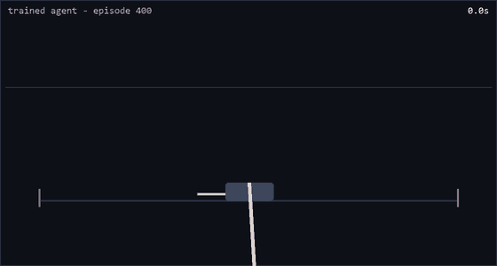
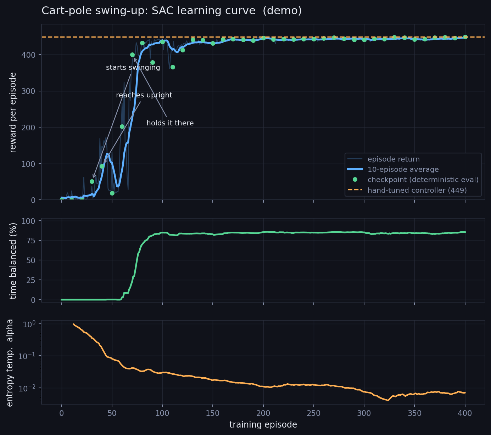
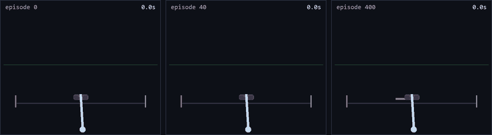

# Pendulum Swing-Up

A cart-pole swing-up environment with honest physics, a Soft Actor-Critic agent that
learns it from scratch, and two viewers built for showing the learning process to an
audience: an interactive pygame window and a web page that replays saved checkpoints
side by side.

Built as the demo for a lightning talk on reinforcement learning.



The rod is unpowered. The only control is a horizontal force on the cart, the rail
is 2.4 m either side, and the force limit is too small to lift the rod directly —
so it has to be swung up and then caught. The amber bar at the bottom is the
force being applied; the rod turns green when it is genuinely balanced.

## What this is, in plain terms

A cart sits on a short rail with a rod hinged on top of it, hanging down. You can only
push the cart left or right — nothing turns the rod directly. The goal is to get the rod
standing straight up and keep it there.

That is harder than it sounds, and the push limit is set so you cannot just flick the rod
up. You have to rock the cart back and forth to build up swing, then catch the rod at the
top before it topples. Try it yourself in `play.py`; most people cannot do it.

Here is everything in this repo, in order:

1. **A simulator.** `swingup/physics.py` works out how the cart and rod move under
   gravity, given whatever force you apply. The equations were derived rather than
   copied, and there is a small amount of friction in the hinge and on the rail so the
   rod does not swing forever. It steps forward 50 times per simulated second.

2. **A score.** `swingup/env.py` gives a number from 0 to 1 every step: 1 for standing
   perfectly upright and still near the middle of the rail, 0 for hanging down. That
   score is the *only* thing the learner is ever told. Nobody explains gravity, momentum,
   or that swinging and balancing are two different jobs.

3. **A learner.** `swingup/sac.py` is a Soft Actor-Critic agent — a neural network that
   tries things, remembers what happened, and gradually shifts towards whatever scored
   better. About 200 lines, no machine-learning library beyond PyTorch itself.

4. **Training with snapshots.** `train.py` runs 400 attempts of 10 seconds each and saves
   a copy of the network every 10 attempts, plus a fair test score for each copy. That is
   what makes it possible to replay any stage of learning afterwards, from useless to
   expert.

5. **Two ways to watch.** `play.py` is an interactive window where you can play yourself,
   hand over to any saved snapshot, and shove the rod to see it recover.
   `web/index.html` plays several snapshots side by side, in lockstep, from an identical
   starting position.

**What happened.** It flailed uselessly for 30 attempts, started swinging around attempt
30, first touched vertical at attempt 40, briefly got *worse* around attempt 50, and was
balancing reliably by attempt 70 — roughly two minutes of laptop CPU time. It plateaued at
a score of ~448 out of a realistic maximum of ~450.



For comparison, `swingup/baseline.py` is the traditional engineered solution to the same
problem. It scores about the same, ~449. The interesting difference is not the score but
what each approach needed from a human, which is the table further down.

## Quickstart

```bash
pip install -r requirements.txt

python train.py --episodes 400 --run demo    # ~15 min on a CPU
python play.py  --run demo                   # interactive viewer
python export_replay.py --run demo           # build the web replay
python plot_metrics.py --run demo --dark     # slide-ready training curve
python make_gifs.py                          # README animations, from the replay
```

Then open `web/index.html` in a browser (it works straight off the filesystem, no server).

## The task

The rod hangs down. The cart can be pushed left or right, and that is the *only*
input — nothing drives the hinge. The force limit is deliberately set so the rod
cannot be flicked upright in one motion: the agent has to swing back and forth,
adding energy on each pass, then catch the rod at the top and hold it.

The rail is short enough that the obvious strategy of accelerating forever fails.
Learning to pump energy *while staying near the middle of the rail* is the actual
difficulty.

## Physics

`swingup/physics.py`. Derived from the Lagrangian rather than copied, so damping and
the rod's moment of inertia enter in the right places. `th` is measured from
**upright**, so `th = 0` is the goal and `th = pi` is hanging.

With `J = (4/3) m l²` the rod's inertia about the pivot, the accelerations solve

```
| M+m          m l cos(th) | | xdd  |   | F - b_cart·xd + m l sin(th)·thd²  |
| m l cos(th)  J           | | thdd | = | m g l sin(th) - b_pole·thd        |
```

Integrated with **RK4** at 50 Hz, two sub-steps per control step. Euler was rejected
on purpose: this is an energy-shaping task, and Euler's per-step energy drift is
exactly the kind of thing an RL agent finds and exploits. The test suite pins the
drift at under `1e-5` J over 50 simulated seconds.

### On air resistance — is it a bad idea?

It was a good idea, kept, but small. Two viscous terms: `b_pole = 0.02` at the hinge
and `b_cart = 0.05` on the rail.

- **Why keep it**: a frictionless rod conserves energy perfectly, so a policy can
  park it upright and coast. With damping, holding the balance requires continuous
  small corrections, which is *visibly* more interesting and matches what a real rig
  does.
- **Why keep it small**: damping fights the energy pumping. Turn it up and swing-up
  takes many more oscillations, training gets slower, and at some point the force
  limit can no longer overcome it at all.
- **Why linear and not quadratic**: true aerodynamic drag goes as `v²`, and
  `swingup/physics.py` could take a `b2·thd·|thd|` term easily. At the speeds here
  (under ~10 rad/s on a 1.2 m rod) it is not visually distinguishable from the linear
  term, and it adds a parameter to tune. Linear is the better trade for a talk.

Set `b_cart=0, b_pole=0` in `PhysicsParams` to compare — the textbook benchmark is
frictionless, so that mode is worth having.

## Reward

The whole task is specified by one line in `swingup/env.py`:

```python
upright  = (1 + cos(th)) / 2                 # 0 hanging, 1 upright
slow     = 1 / (1 + 0.1·thd²)                # 1 when the rod is still
centered = 1 / (1 + 0.5·(x / x_limit)²)      # 1 at the middle of the rail
reward   = upright · (0.5 + 0.5·slow) · centered − 0.002·action²
```

The terms **multiply**, and that is the important design decision. A sum would
penalise angular velocity everywhere, including while hanging — which punishes the
one behaviour the agent must discover first, and it never learns to swing at all.
Multiplying gates the stillness penalty behind `upright`: spinning fast at the bottom
costs almost nothing, spinning fast at the top costs most of the reward. There is a
test asserting exactly that (`test_velocity_penalty_is_gated_by_uprightness`).

Max reward is 1.0 per step, so 500 for a perfect 500-step episode. Swing-up itself
costs ~60 steps, making ~450 the realistic ceiling.

## The agent

`swingup/sac.py` — Soft Actor-Critic, ~200 lines, no RL library, so any line of it can
be pointed at mid-talk.

- **Observation (5)**: `[x/x_limit, xd/5, cos(th), sin(th), thd/10]`. `cos`/`sin`
  instead of raw angle so the network never sees the discontinuity at ±pi; the
  divisors keep every input near unit scale.
- **Action (1)**: continuous force in `[-1, 1]`, scaled to ±15 N.
- **Why SAC**: balancing needs fine force near vertical, which a discrete
  left/none/right action space handles badly; and the learned entropy temperature
  supplies the exploration needed to stumble onto the first successful swing without
  anyone hand-tuning a noise schedule.
- 128×128 MLPs, twin critics with `min` targets, target networks at `tau = 0.005`,
  batch 256, `gamma = 0.99`.

### The classical baseline

`swingup/baseline.py` solves the same task without learning: Åström–Furuta energy
pumping, switching to linear feedback within 0.6 rad of vertical. It scores **~449**.

It is in the repo to be *compared against*, and the comparison is not about the score
— SAC matches it. It is about what each one needed:

| | hand-tuned controller | SAC |
|---|---|---|
| needs the equations of motion | yes | no |
| needs mass, length, gravity | yes | no |
| needs hand-picked gains | 5 of them | none |
| needs someone to notice swing-up and balancing are different problems | yes | no |
| needs a reward function | no | yes |
| needs ~200 episodes of experience | no | yes |

## Checkpoints, and replaying training

Every 10 episodes, `train.py` writes a checkpoint *and* runs a fixed-seed
deterministic evaluation, so the score attached to episode 40 and the score attached
to episode 300 are directly comparable.

```
runs/demo/
  config.json      physics, reward and SAC settings for this run
  metrics.csv      one row per training episode
  checkpoints/     ep00000.pt, ep00010.pt, ... latest.pt
  manifest.json    checkpoint index with each one's eval score
  curve_dark.png   the training curve
```

Episode 0 is saved **before any learning**, so the untrained flailing policy is always
available as the "before" clip.



*Three checkpoints, same starting state, same random seed, played in lockstep. Left:
random pushes, off the rail in two seconds. Middle: it reaches the top but sails
straight past it. Right: it arrives and holds. The only difference between the three
is how many episodes of practice the policy had.*

`export_replay.py` picks story beats rather than evenly spaced episodes — untrained,
first real swing, first time upright, first balance, best — because "the first time it
ever touched vertical" is a better slide than "episode 120".

## Viewers

### `play.py` — interactive

| key | |
|---|---|
| `←` `→` | push the cart (human mode) |
| `TAB` | cycle HUMAN → AGENT → BASELINE |
| `[` `]` | previous / next checkpoint |
| `0`–`9` | jump to 0%–90% through training |
| `E` | jump to the best checkpoint |
| `P` | poke the rod with a random impulse |
| `,` `.` | shorten / lengthen the rod, live |
| `R` `SPACE` `-` `=` `T` | reset, pause, slower, faster, trail |

### `web/index.html` — replay

Clip chips select any number of checkpoints and they play **in lockstep**, from an
identical starting state with the same seed, so the only difference between panels is
how much training the policy had. Includes the training curve with clickable
checkpoint dots.

## A 5-minute structure

1. **(45 s) Show the problem.** `play.py` in HUMAN mode. Try to swing it up yourself.
   Failing at it live is the best possible setup, and the audience immediately
   understands that "push left or right" and "get the rod upright" are related by
   something non-obvious.
2. **(45 s) State the task the way the agent gets it.** Five numbers in, one number
   out, and the reward line. Nobody told it about energy, momentum, or two-phase
   control.
3. **(90 s) Show learning.** The web page, three panels in lockstep: untrained,
   first-time-upright, best. Then the curve — and point at the dip around episode 50,
   where it *got worse*. That dip is the honest part of RL and everyone recognises it.
4. **(60 s) Show what it wasn't told.** Press `P` and shove the balanced rod. It
   recovers. Nobody wrote recovery behaviour; it falls out of having been rewarded for
   being upright from every state it ever stumbled into.
5. **(45 s) Land the comparison.** The classical controller table above. Same score,
   completely different thing required from the engineer.
6. **(15 s) Optional gut-punch.** Press `.` a few times to lengthen the rod. The
   policy degrades, then fails. That is the sim-to-real gap, in one keystroke.

## Things worth trying

- `python train.py --force-mag 10 --run weak` — a force limit low enough that the
  hand-tuned controller stalls at 35° from vertical. Does SAC still find a way?
- `python train.py --seed 3 --run seed3` — run-to-run variance in RL is large and
  worth showing honestly; some seeds find the swing much later than others.
- Set `RewardParams(vel_weight=0.0)` and retrain to see the reward design matter.
- Add a `b2·thd·|thd|` quadratic drag term to `derivative()` and see whether a policy
  trained without it still transfers.

## Tests

```bash
python -m pytest tests -q
```

24 tests, mostly physics invariants: energy conservation without damping, horizontal
momentum conservation, damping never *adding* energy, RK4 agreeing with a 10× finer
integrator, hanging being stable and upright not, and the reward-shaping properties
the agent depends on.

These exist because a broken simulator does not produce a broken-looking policy — it
produces a policy that scores brilliantly and behaves absurdly, and the bug surfaces
only much later.
